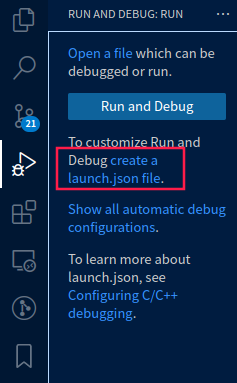

# 原视频链接

[基于VSCode和CMake实现C/C++开发 | Linux篇](https://www.bilibili.com/video/BV1fy4y1b7TC/?spm_id_from=333.337.search-card.all.click&vd_source=ebf9103aa7bb680610fdd7124d317e9d)

# 开发环境搭建

## 编译器 调试器安装

安装GCC GDB

```bash
# 更新软件源
sudo apt update
# 安装编译器和调试器，
sudo apt install build-essential gdb
```

安装成功确认

```bash
gcc --version
g++ --version
gdb --version
```

## CMake安装

安装cmake

```bash
sudo apt install cmake
```

安装成功确认

```bash
cmake --version
```

# GCC编译器

1.GCC编译器支持编译Go、Objective-C、Objective-C++、Fortran等程序

2.Linux开发C\C++一定需要熟悉GCC

3.VSCode是通过调用GCC编译器来实现C\C++的编译工作

实际使用中：

- 使用gcc指令编译C代码
- 使用g++指令编译C++代码

## 编译过程

1.预处理-Pre-Processing

```bash
# -E 选项指示编译器仅对输入文件进行预处理
g++ -E test.cpp -o test.i
```

2.编译-Compiling

```bash
# -S 编译选项告诉g++ 在为C++代码产生了编译语言文件后停止编译
# g++ 产生的汇编语言文件的缺省扩展名 .s
g++ -S test.i -o test.s
```

3.汇编-Assembling

```bash
# -c 选项告诉g++ 进把源码编译为机器语言的目标代码
# 缺省时 g++ 建立的模具表代码文件哟一个 .o 的扩展名
g++ -c test.s -o test.o
```

4.l链接-Linking

```bash
# -o 编译选项来为将产生的可执行文件用指定的文件名
g++ test.o -o test
```

## g++重要编译参数

1.-g 编译带调试信息的可执行文件

```bash
# -g 选项告诉 GCC 产生能被 GNU 调试器GDB使用的调试信息，以调试程序。

# 产生带调试信息的可执行文件test
g++ -g test.cpp
```

2.-O[n] 优化源代码

```bash
## 所谓优化，例如省略掉代码中从未使用过的变量、直接将常量表达式用结果值代替等等，这些操作
会缩减目标文件所包含的代码量，提高最终生成的可执行文件的运行效率。

# -O 选项告诉 g++ 对源代码进行基本优化。这些优化在大多数情况下都会使程序执行的更快。 -O2 
选项告诉 g++ 产生尽可能小和尽可能快的代码。 如-O2，-O3，-On（n 常为0–3）
# -O 同时减小代码的长度和执行时间，其效果等价于-O1
# -O0 表示不做优化
# -O1 为默认优化
# -O2 除了完成-O1的优化之外，还进行一些额外的调整工作，如指令调整等。
# -O3 则包括循环展开和其他一些与处理特性相关的优化工作。
# 选项将使编译的速度比使用 -O 时慢， 但通常产生的代码执行速度会更快。

# 使用 -O2优化源代码，并输出可执行文件
g++ -O2 test.cpp
```

3.-l 和 -L 指定库文件 | 指定库文件路径

```bash
# -l参数(小写)就是用来指定程序要链接的库，-l参数紧接着就是库名
# 在/lib和/usr/lib和/usr/local/lib里的库直接用-l参数就能链接

# 链接glog库 g++ -lglog test.cpp

# 如果库文件没放在上面三个目录里，需要使用-L参数(大写)指定库文件所在目录
# -L参数跟着的是库文件所在的目录名

# 链接mytest库，libmytest.so在/home/bing/mytestlibfolder目录下
g++ -L/home/bing/mytestlibfolder -lmytest test.cpp
```

4.-I 指定头文件搜索目录

```bash
# -I 
# /usr/include目录一般是不用指定的，gcc知道去那里找，但 是如果头文件不在/usr/icnclude
里我们就要用-I参数指定了，比如头文件放在/myinclude目录里，那编译命令行就要加上-
I/myinclude 参数了，如果不加你会得到一个”xxxx.h: No such file or directory”的错
误。-I参数可以用相对路径，比如头文件在当前 目录，可以用-I.来指定。上面我们提到的–cflags参
数就是用来生成-I参数的。

g++ -I/myinclude test.cpp
```

5.-Wall 打印警告信息

```bash
# 打印出gcc提供的警告信息
g++ -Wall test.cpp
```

6.-w 关闭警告信息

```bash
# 关闭所有警告信息
g++ -w test.cpp
```

7.-std=c++11 设置编译标准

```bash
# 使用 c++11 标准编译 test.cpp
g++ -std=c++11 test.cpp
```

8.-o 指定输出文件名

```bash
# 指定即将产生的文件名

# 指定输出可执行文件名为test
g++ test.cpp -o test
```

9.-D 定义宏

```bash
# 在使用gcc/g++编译的时候定义宏

# 常用场景：
# -DDEBUG 定义DEBUG宏，可能文件中有DEBUG宏部分的相关信息，用个DDEBUG来选择开启或关闭
DEBUG
```

示例代码：

```bash
// -Dname 定义宏name,默认定义内容为字符串“1”

#include <stdio.h>

int main()
{
    #ifdef DEBUG
   printf("DEBUG LOG\n");
    #endif
   printf("in\n");
}

// 1. 在编译的时候，使用g++ -DDEBUG main.cpp
// 2. 第七行代码可以被执行
```

注：使用 man gcc 命令可以查看gcc英文使用手册

## g++命令行编译

demo代码：code/swap

```bash
# 最初目录结构

.
├── include
│   └── swap.h
├── main.cpp
└── src
   └── swap.cpp
    
2 directories, 3 files
```

### 直接编译

最简单的编译，并运行

```bash
# 将 main.cpp src/swap.cpp 编译为可执行文件
g++ main.cpp src/swap.cpp -Iinclude
# 运行a.out
./a.out
```

增加参数编译，并运行

```bash
# 将 main.cpp src/swap.cpp 编译为可执行文件 附带一堆参数
g++ main.cpp src/swap.cpp -Iinclude -std=c++11 -O2 -Wall -o b.out
# 运行 b.out
./b.out
```

### 生成库文件并编译

链接静态库生成可执行文件：

```bash
## 进入src目录下
cd src

# 汇编，生成Swap.o文件
g++ swap.cpp -c -I../include
# 生成静态库libSwap.a
ar rs libswap.a swap.o

## 回到上级目录
cd ..

# 链接，生成可执行文件:staticmain
g++ main.cpp -Iinclude -Lsrc -lswap -o staticmain
```

链接动态库生成可执行文件

```bash
## 进入src目录下
cd src

# 生成动态库libSwap.so
g++ swap.cpp -I../include -fPIC -shared -o libswap.so

## 上面命令等价于以下两条命令
# gcc swap.cpp -I../include -c -fPIC
# gcc -shared -o libswap.so swap.o

## 回到上级目录
cd ..

# 链接，生成可执行文件:sharemain
g++ main.cpp -Iinclude -Lsrc -lswap -o sharemain
```

运行可执行文件

```bash
# 静态编译的
./staticmain

# 动态编译的
LD_LIBRARY_PATH=src ./sharemain
```

# GDB调试器

前言：

- GDB(GNU Debugger)是一个用来调试C/C++程序的功能强大的调试器，是Linux系统开发

C/C++最常用的调试器

- 程序员可以使用GDB来跟踪程序中的错误，从而减少程序员的工作量。
- Linux 开发C/C++ 一定要熟悉 GDB
- VSCode是通过调用GDB调试器来实现C/C++的调试工作的；

GDB主要功能：

- 设置断点(断点可以是条件表达式)
- 使程序在指定的代码行上暂停执行，便于观察
- 单步执行程序，便于调试
- 查看程序中变量值的变化
- 动态改变程序的执行环境
- 分析崩溃程序产生的core文件

## 常用调试命令参数

调试开始：执行gdb [exefilename] ，进入gdb调试程序，其中exefilename为要调试的可执行文件名

```bash
## 以下命令后括号内为命令的简化使用，比如run（r），直接输入命令 r 就代表命令run
$(gdb)help(h) # 查看命令帮助，具体命令查询在gdb中输入help + 命令

$(gdb)run(r) # 重新开始运行文件（run-text：加载文本文件，run-bin：加载二进制文件）

$(gdb)start # 单步执行，运行程序，停在第一行执行语句

$(gdb)list(l) # 查看原代码（list-n,从第n行开始查看代码。list+ 函数名：查看具体函数）

$(gdb)set # 设置变量的值

$(gdb)next(n)   # 单步调试（逐过程，函数直接执行）

$(gdb)step(s) # 单步调试（逐语句：跳入自定义函数内部执行）

$(gdb)backtrace(bt) # 查看函数的调用的栈帧和层级关系

$(gdb)frame(f) # 切换函数的栈帧

$(gdb)info(i) # 查看函数内部局部变量的数值

$(gdb)finish # 结束当前函数，返回到函数调用点

$(gdb)continue(c) # 继续运行

$(gdb)print(p) # 打印值及地址

$(gdb)quit(q) # 退出gdb

$(gdb)break+num(b) # 在第num行设置断点

$(gdb)info breakpoints # 查看当前设置的所有断点

$(gdb)delete breakpoints num(d) # 删除第num个断点

$(gdb)display # 追踪查看具体变量值

$(gdb)undisplay # 取消追踪观察变量

$(gdb)watch # 被设置观察点的变量发生修改时，打印显示

$(gdb)i watch # 显示观察点

$(gdb)enable breakpoints # 启用断点

$(gdb)disable breakpoints # 禁用断点

$(gdb)x # 查看内存x/20xw 显示20个单元，16进制，4字节每单元

$(gdb)run argv[1] argv[2] # 调试时命令行传参

$(gdb)set follow-fork-mode child#Makefile项目管理：选择跟踪父子进程（fork()）
```

Tips:

> 编译程序时需要加上-g，之后才能用gdb进行调试：gcc -g main.c -o main
>
> 回车键：重复上一命令

## 命令行调试

demo代码：code/sum

```bash
# 编译
g++ -g sum.cpp -o sum
# 进入调试
gdb sum
```

# IDE - VSCode

## 插件安装

Linux下开发C/C++的三款必备插件

C/C++

CMake

CMake Tools

## 快捷键

| 功能              | 快捷键           | 功能          | 快捷键        |
| ----------------- | ---------------- | ------------- | ------------- |
| 转到文件/其他操作 | Ctrl + P         | 关闭当前文件  | Ctrl + W      |
| 打开命令面板      | Ctrl + Shift + P | 当前上移/下移 | Alt + Up/Down |
| 打开终端          | Ctrl + Shift + ` | 变量统一命名  | F2            |
| 关闭侧边栏        | Ctrl + B         | 转到定义处    | F12           |
| 复制文本          | Ctrl + C         | 粘贴文本      | Ctrl + V      |
| 保存文件          | Ctrl + S         | 撤销操作      | Ctrl + Z      |

在 Ctrl+P 窗口下还可以:

- 直接输入文件名，跳转到文件
- ? 列出当前可执行的动作
- ! 显示 Errors 或 Warnings ，也可以 Ctrl+Shift+M
- : 跳转到行数，也可以 Ctrl+G 直接进入
- @ 跳转到 symbol （搜索变量或者函数），也可以 Ctrl+Shift+O 直接进入
- @ 根据分类跳转 symbol ，查找属性或函数，也可以 Ctrl+Shift+O 后输入:进入
- `#`根据名字查找 symbol ，也可以 Ctrl+T

快捷键：编辑器与窗口管理

- 打开一个新窗口： Ctrl+Shift+N
- 关闭窗口： Ctrl+Shift+W
- 同时打开多个编辑器（查看多个文件）
- 新建文件 Ctrl+N
- 文件之间切换 Ctrl+Tab
- 切出一个新的编辑器（最多 3 个） Ctrl+\ ，也可以按住 Ctrl 鼠标点击 Explorer 里的文件名
- 左中右 3 个编辑器的快捷键 Ctrl+1 Ctrl+2 Ctrl+3
- 3 个编辑器之间循环切换 Ctrl+
- 编辑器换位置， Ctrl+k 然后按 Left 或 Right

快捷键：格式调整

- 代码行缩进 Ctrl+[ 、 Ctrl+]
- Ctrl+C 、 Ctrl+V 复制或剪切当前行/当前选中内容
- 代码格式化： Shift+Alt+F ，或 Ctrl+Shift+P 后输入 format code
- 上下移动一行： Alt+Up 或 Alt+Down
- 向上向下复制一行： Shift+Alt+Up 或 Shift+Alt+Down
- 在当前行下边插入一行 Ctrl+Enter
- 在当前行上方插入一行 Ctrl+Shift+Enter

快捷键：光标相关

- 移动到行首： Home
- 移动到行尾： End
- 移动到文件结尾： Ctrl+End
- 移动到文件开头： Ctrl+Home
- 移动到定义处： F12
- 定义处缩略图：只看一眼而不跳转过去 Alt+F12
- 移动到后半个括号： Ctrl+Shift+]
- 选择从光标到行尾： Shift+End
- 选择从行首到光标处： Shift+Home
- 删除光标右侧的所有字： Ctrl+Delete
- 扩展/缩小选取范围： Shift+Alt+Left 和 Shift+Alt+Right
- 多行编辑(列编辑)： Alt+Shift+鼠标左键 ， Ctrl+Alt+Down/Up
- 同时选中所有匹配： Ctrl+Shift+L
- Ctrl+D 下一个匹配的也被选中 (在 sublime 中是删除当前行，后面自定义快键键中，设置与Ctrl+Shift+K 互换了)
- 回退上一个光标操作： Ctrl+U

快捷键：重构代码

- 找到所有的引用： Shift+F12
- 同时修改本文件中所有匹配的： Ctrl+F12
- 重命名：比如要修改一个方法名，可以选中后按 F2 ，输入新的名字，回车，会发现所有的文件都修改了
- 跳转到下一个 Error 或 Warning ：当有多个错误时可以按 F8 逐个跳转
- 查看 diff ： 在 explorer 里选择文件右键 Set file to compare ，然后需要对比的文件上右键选择 Compare with file_name_you_chose

快捷键：查找替换

- 查找 Ctrl+F
- 查找替换 Ctrl+H
- 整个文件夹中查找 Ctrl+Shift+F

快捷键：显示相关

- 全屏： F11
- zoomIn/zoomOut： Ctrl +/-
- 侧边栏显/隐： Ctrl+B
- 显示资源管理器 Ctrl+Shift+E
- 显示搜索 Ctrl+Shift+F
- 显示 Git Ctrl+Shift+G
- 显示 Debug Ctrl+Shift+D
- 显示 Output Ctrl+Shift+U

# CMake

- CMake是一个跨平台的安装编译工具，可以用简单的语句来描述所有平台的安装(编译过程)。
- CMake可以说已经成为大部分C++开源项目标配

## 语法特性介绍

基本语法格式：指令(参数 1 参数 2...)

- 参数使用括弧括起
- 参数之间使用空格或分号分开

指令是大小写无关的，参数和变量是大小写相关的

```bash
set(HELLO hello.cpp)
add_executable(hello main.cpp hello.cpp)
ADD_EXECUTABLE(hello main.cpp ${HELLO})
```

变量使用${}方式取值，但是在 IF 控制语句中是直接使用变量名

## 重要指令和CMake常用变量

### 重要指令

#### cmake_minimum_required

- 指定CMake的最小版本要求

语法： cmake_minimum_required(VERSION versionNumber [FATAL_ERROR])

```bash
# CMake最小版本要求为2.8.3
cmake_minimum_required(VERSION 2.8.3)
```

#### project

- 定义工程名称，并可指定工程支持的语言

语法： project(projectname [CXX] [C] [Java])

```bash
# 指定工程名为HELLOWORLD
project(HELLOWORLD)
```

#### set

- 显式的定义变量

语法：set(VAR [VALUE] [CACHE TYPE DOCSTRING [FORCE]])

```bash
# 定义SRC变量，其值为sayhello.cpp hello.cpp
set(SRC sayhello.cpp hello.cpp)
```

#### include_directories

- 向工程添加多个特定的头文件搜索路径 --->相当于指定g++编译器的-I参数

语法： include_directories([AFTER|BEFORE] [SYSTEM] dir1 dir2 ...)

```bash
# 将/usr/include/myincludefolder 和 ./include 添加到头文件搜索路径
include_directories(/usr/include/myincludefolder ./include)
```

#### target_include_directories

- 为指定目标（target）添加搜索路径，指定目标是指通过如add_executable()，add_library()这样的命令生成的，并且决不能是alias target（引用目标，别名目标）

语法：target_include_directories(`<target>` [SYSTEM] [AFTER|BEFORE]  <INTERFACE|PUBLIC|PRIVATE> [items1...]  [<INTERFACE|PUBLIC|PRIVATE> [items2...] ...])

- AFTER或BEFORE

  可以选择让添加的路径位于搜索列表的开头或结尾。缺省时，默认是AFTER。
- INTERFACE，PUBLIC，PRIVATE

  指定接下来的参数item（即路径）的作用域：

> INTERFACE target对应的头文件才能使用，会指定target的属性INTERFACE_INCLUDE_DIRECTORIES

> PUBLIC target对应头文件和源文件都能使用，会指定target的属性INCLUDE_DIRECTORIES 和INTERFACE_INCLUDE_DIRECTORIES

> PRIVATE target对应源文件使用，会指定target的属性INCLUDE_DIRECTORIES

```bash
# 单独为目标projectA添加搜索路径include1。
target_include_directories(projectA ./include1) # 注意当前CMakeLists.txt与include1路径的相对位置关系

add_executable(projectA main.cpp)
```

- include_directories与target_include_directories区别

> include_directories 会为当前CMakeLists.txt的所有目标，以及之后添加的所有子目录的目标添加头文件搜索路径。因此，慎用include_directories，因为会影响全局target。

> target_include_directories 只会为指定目标包含头文件搜索路径。如果想为不同目标设置不同的搜索路径，那么用target_include_directories更合适。

#### link_directories

- 向工程添加多个特定的库文件搜索路径 --->相当于指定g++编译器的-L参数

语法： link_directories(dir1 dir2 ...)

```bash
# 将/usr/lib/mylibfolder 和 ./lib 添加到库文件搜索路径
link_directories(/usr/lib/mylibfolder ./lib)
```

#### target_link_libraries

- 为 target 添加需要链接的共享库 --->相同于指定g++编译器-l参数

语法： target_link_libraries(target library1<debug | optimized> library2...)

```bash
# 将hello动态库文件链接到可执行文件main
target_link_libraries(main hello)
```

#### add_library

- 生成库文件

语法： add_library(libname [SHARED|STATIC|MODULE] [EXCLUDE_FROM_ALL]

source1 source2 ... sourceN)

```bash
# 通过变量 SRC 生成 libhello.so 共享库
add_library(hello SHARED ${SRC})
```

#### add_compile_options

- 添加编译参数

语法：add_compile_options

```bash
# 添加编译参数 -Wall -std=c++11 -O2
add_compile_options(-Wall -std=c++11 -O2)
```

#### add_executable

- 生成可执行文件

语法：add_executable(exename source1 source2 ... sourceN)

```bash
# 编译main.cpp生成可执行文件main
add_executable(main main.cpp)
```

#### add_subdirectory

- 向当前工程添加存放源文件的子目录，并可以指定中间二进制和目标二进制

存放的位置

语法： add_subdirectory(source_dir [binary_dir] [EXCLUDE_FROM_ALL])

```bash
# 添加src子目录，src中需有一个CMakeLists.txt
add_subdirectory(src)
```

#### aux_source_directory

- 发现一个目录下所有的源代码文件并将列表存储在一个变量中，这个指

令临时被用来自动构建源文件列表

语法： aux_source_directory(dir VARIABLE)

```bash
# 定义SRC变量，其值为当前目录下所有的源代码文件
aux_source_directory(. SRC)
# 编译SRC变量所代表的源代码文件，生成main可执行文件
add_executable(main ${SRC})
```

#### install

参考链接：[cmake的install指令](https://blog.csdn.net/qq_38410730/article/details/102837401)

在 `cmake`的时候，最常见的几个步骤就是：

```bash
mkdir build && cd build
cmake ..
make
make install
```

那么，`make install`的时候，是需要我们定义一个 `install`的目标么？

显然并不需要，作为一个经常需要被运行的指令，官方提供了一个命令 `install`，只需要经过该命令的安装内容，不需要显示地定义 `install`目标。此时，`make install`就是运行该命令的内容。

**install用于指定在安装时运行的规则。它可以用来安装很多内容，可以包括目标二进制、动态库、静态库以及文件、目录、脚本等** ：

```bash
install(TARGETS <target>... [...])
install({FILES | PROGRAMS} <file>... [...])
install(DIRECTORY <dir>... [...])
install(SCRIPT <file> [...])
install(CODE <code> [...])
install(EXPORT <export-name> [...])
```

有时候，也会用到一个非常有用的变量 `CMAKE_INSTALL_PREFIX`， **用于指定cmake install时的相对地址前缀** 。用法如：

```cmake
cmake -DCMAKE_INSTALL_PREFIX=/usr ..
```

##### 目标文件的安装

参数中的 `TARGET`可以是很多种目标文件，最常见的是 **通过ADD_EXECUTABLE或者ADD_LIBRARY定义的目标文件，即可执行二进制、动态库、静态库** ：

| 目标文件       | 内容                    | 安装目录变量                | 默认安装文件夹 |
| -------------- | ----------------------- | --------------------------- | -------------- |
| ARCHIVE        | 静态库                  | ${CMAKE_INSTALL_LIBDIR}     | lib            |
| LIBRARY        | 动态库                  | ${CMAKE_INSTALL_LIBDIR}     | lib            |
| PUBLIC_HEADER  | 与库关联的PUBLIC头文件  | ${CMAKE_INSTALL_INCLUDEDIR} | include        |
| PRIVATE_HEADER | 与库关联的PRIVATE头文件 | ${CMAKE_INSTALL_INCLUDEDIR} | include        |

为了符合一般的默认安装路径，如果设置了 `DESTINATION`参数，推荐配置在安装目录变量下的文件夹。

```cmake
INSTALL(TARGETS myrun mylib mystaticlib
       RUNTIME DESTINATION ${CMAKE_INSTALL_BINDIR}
       LIBRARY DESTINATION ${CMAKE_INSTALL_LIBDIR}
       ARCHIVE DESTINATION ${CMAKE_INSTALL_LIBDIR}
)
```

```bash
上面的例子会将：
可执行二进制myrun安装到${CMAKE_INSTALL_BINDIR}目录，
动态库libmylib.so安装到${CMAKE_INSTALL_LIBDIR}目录，
静态库libmystaticlib.a安装到${CMAKE_INSTALL_LIBDIR}目录。
```

该命令的其他一些参数的含义：

- DESTINATION：指定磁盘上要安装文件的目录；
- PERMISSIONS：指定安装文件的权限。有效权限是OWNER_READ，OWNER_WRITE，OWNER_EXECUTE，GROUP_READ，GROUP_WRITE，GROUP_EXECUTE，WORLD_READ，WORLD_WRITE，WORLD_EXECUTE，SETUID和SETGID；
- CONFIGURATIONS：指定安装规则适用的构建配置列表(DEBUG或RELEASE等)；
- EXCLUDE_FROM_ALL：指定该文件从完整安装中排除，仅作为特定于组件的安装的一部分进行安装；
- OPTIONAL：如果要安装的文件不存在，则指定不是错误。

注意一下 `CONFIGURATIONS`参数， **此选项指定的值仅适用于此选项之后列出的选项** ：例如，要为调试和发布配置设置单独的安装路径，请执行以下操作：

```cmake
install(TARGETS target
        CONFIGURATIONS Debug
        RUNTIME DESTINATION Debug/bin)
install(TARGETS target
        CONFIGURATIONS Release
        RUNTIME DESTINATION Release/bin)
```

也就是说，`DEBUG和RELEASE`版本的 `DESTINATION`安装路径不同，那么 `DESTINATION`必须在 `CONFIGUATIONS`后面。

##### 普通文件的安装

```cmake
install(<FILES|PROGRAMS> files...
        TYPE <type> | DESTINATION <dir>
        [PERMISSIONS permissions...]
        [CONFIGURATIONS [Debug|Release|...]]
        [COMPONENT <component>]
        [RENAME <name>] [OPTIONAL] [EXCLUDE_FROM_ALL])
```

FILES|PROGRAMS若为相对路径给出的文件名，将相对于当前源目录进行解释。其中，FILES为普通的文本文件，PROGRAMS指的是非目标文件的可执行程序(如脚本文件)。

如果未提供PERMISSIONS参数，默认情况下，普通的文本文件将具有OWNER_WRITE，OWNER_READ，GROUP_READ和WORLD_READ权限，即644权限；而非目标文件的可执行程序将具有OWNER_EXECUTE, GROUP_EXECUTE,和WORLD_EXECUTE，即755权限。

其中，不同的TYPE，cmake也提供了默认的安装路径，如下表：

| TYPE类型    | 安装目录变量                   | 默认安装文件夹 |
| ----------- | ------------------------------ | -------------- |
| BIN         | ${CMAKE_INSTALL_BINDIR}        | bin            |
| SBIN        | ${CMAKE_INSTALL_SBINDIR}       | sbin           |
| LIB         | ${CMAKE_INSTALL_LIBDIR}        | lib            |
| INCLUDE     | ${CMAKE_INSTALL_INCLUDEDIR}    | include        |
| SYSCONF     | ${CMAKE_INSTALL_SYSCONFDIR}    | etc            |
| SHAREDSTATE | ${CMAKE_INSTALL_SHARESTATEDIR} | com            |
| LOCALSTATE  | ${CMAKE_INSTALL_LOCALSTATEDIR} | var            |
| RUNSTATE    | ${CMAKE_INSTALL_RUNSTATEDIR}   | /run           |
| DATA        | ${CMAKE_INSTALL_DATADIR}       |                |
| INFO        | ${CMAKE_INSTALL_INFODIR}       | /info          |
| LOCALE      | ${CMAKE_INSTALL_LOCALEDIR}     | /locale        |
| MAN         | ${CMAKE_INSTALL_MANDIR}        | /man           |
| DOC         | ${CMAKE_INSTALL_DOCDIR}        | /doc           |

请注意，某些类型的内置默认值使用 `DATAROOT`目录作为前缀，以 `CMAKE_INSTALL_DATAROOTDIR`变量值为内容。

该命令的其他一些参数的含义：

- DESTINATION：指定磁盘上要安装文件的目录；
- PERMISSIONS：指定安装文件的权限。有效权限是OWNER_READ，OWNER_WRITE，OWNER_EXECUTE，GROUP_READ，GROUP_WRITE，GROUP_EXECUTE；
- WORLD_READ，WORLD_WRITE，WORLD_EXECUTE，SETUID和SETGID；
  CONFIGURATIONS：指定安装规则适用的构建配置列表(DEBUG或RELEASE等)；
- EXCLUDE_FROM_ALL：指定该文件从完整安装中排除，仅作为特定于组件的安装的一部分进行安装；
- OPTIONAL：如果要安装的文件不存在，则指定不是错误；
- RENAME：指定已安装文件的名称，该名称可能与原始文件不同。仅当命令安装了单个文件时，才允许重命名。

##### 目录的安装

```cmake
install(DIRECTORY dirs...
        TYPE <type> | DESTINATION <dir>
        [FILE_PERMISSIONS permissions...]
        [DIRECTORY_PERMISSIONS permissions...]
        [USE_SOURCE_PERMISSIONS] [OPTIONAL] [MESSAGE_NEVER]
        [CONFIGURATIONS [Debug|Release|...]]
        [COMPONENT <component>] [EXCLUDE_FROM_ALL]
        [FILES_MATCHING]
        [[PATTERN <pattern> | REGEX <regex>]
         [EXCLUDE] [PERMISSIONS permissions...]] [...])
```

该命令将一个或多个目录的内容安装到给定的目的地，目录结构被逐个复制到目标位置。每个目录名称的最后一个组成部分都附加到目标目录中，但是可以使用后跟斜杠来避免这种情况，因为它将最后一个组成部分留空。这是什么意思呢？

比如，DIRECTORY后面如果是abc意味着abc这个目录会安装在目标路径下，abc/意味着abc这个目录的内容会被安装在目标路径下，而abc目录本身却不会被安装。即，如果目录名不以/结尾，那么这个目录将被安装为目标路径下的abc，如果目录名以/结尾，代表将这个目录中的内容安装到目标路径，但不包括这个目录本身。
FILE_PERMISSIONS和DIRECTORY_PERMISSIONS选项指定对目标中文件和目录的权限。如果指定了USE_SOURCE_PERMISSIONS而未指定FILE_PERMISSIONS，则将从源目录结构中复制文件权限。如果未指定权限，则将为文件提供在命令的FILES形式中指定的默认权限(644权限)，而目录将被赋予在命令的PROGRAMS形式中指定的默认权限(755权限)。

可以使用PATTERN或REGEX选项以精细的粒度控制目录的安装，可以指定一个通配模式或正则表达式以匹配输入目录中遇到的目录或文件。PATTERN仅匹配完整的文件名，而REGEX将匹配文件名的任何部分，但它可以使用/和$模拟PATTERN行为。

某些跟随PATTERN或REGEX表达式后的参数，仅应用于满足表达式的文件或目录。如：EXCLUDE选项将跳过匹配的文件或目录。PERMISSIONS选项将覆盖匹配文件或目录的权限设置。
例如：

```cmake
install(DIRECTORY icons scripts/ DESTINATION share/myproj
        PATTERN "CVS" EXCLUDE
        PATTERN "scripts/*"
        PERMISSIONS OWNER_EXECUTE OWNER_WRITE OWNER_READ
                    GROUP_EXECUTE GROUP_READ)
```

这条命令的执行结果是：将icons目录安装到share/myproj，将scripts/中的内容安装到share/myproj，两个目录均不包含目录名为CVS的子目录，对于scripts/*的文件指定权限为OWNER_EXECUTE，OWNER_WRITE，OWNER_READ，GROUP_EXECUTE，GROUP_READ。

##### 安装时脚本的运行

有时候需要在 `install`的过程中打印一些语句，或者执行一些 `cmake`指令：

```cmake
install([[SCRIPT <file>] [CODE <code>]]
        [COMPONENT <component>] [EXCLUDE_FROM_ALL] [...])
```

`SCRIPT`参数将在安装过程中 **调用给定的CMake脚本文件(即.cmake脚本文件)** ，如果脚本文件名是相对路径，则将相对于当前源目录进行解释。`CODE`参数将在安装过程中调用给定的 `CMake`代码。将代码 **指定为双引号字符串内的单个参数** 。

例如：

```cmake
install(CODE "MESSAGE(\"Sample install message.\")")
```

这条命令将会在 `install`的过程中执行 `cmake`代码，打印语句。

##### 导出信息

参考：[CMake生成库和intall文件](https://blog.csdn.net/DynastyDoubleH/article/details/123007508)

代码：code/cmake-install-export

该命令的基本功能是将指定文件安装（拷贝）到指定目录。和我们主题相关的是 EXPORT

```cmake
install(TARGETS target EXPORT <export_name>) 和 

install(EXPORT <export_name> DESTINATION … FILE .cmake)。
```

```cmake
install(TARGETS targets EXPORT <export_name>)
将目标文件 targets 的可导出信息存储在 <export_name> 中，用于生成可导出文件。
install(EXPORT <export_name> DESTINATION
FILE .cmake)
将 [1] 中产生的 <export_name> 存储在 .cmake文件中，并将 .cmake 安装到
。如果没有指定 .cmake，那么就存储在 <export_name>.cmake 文件中。 
```

install(EXPORT <export_name> …) 命令会生成两个文件—— <export_name>.cmake 和 <export_name>-noconfig.cmake。其中，<export_name>.cmake 会被 configure_file(…) 中 指定的文件使用。而 <export_name>-noconfig.cmake 会被 <export_name>.cmake 文件使用。

<export_name>-noconfig.cmake 中的 noconfig 是什么？指的是 CMAKE_BUILD_TYPE 的值。如果使用 cmake 生成编译系统时指定了 CMAKE_BUILD_TYPE=debug，那么生成的就会是 <export_name>-debug.cmake。

#### configure_file

该命令将 指定的文件拷贝为 指定的文件，并将 文件中 @VAR@ 或 ${VAR} 的位置替换为使用 configure_file()
命令的当前 CMakeLists.txt 中变量 VAR 的值。该命令用于外部文件获取 CMakeLists.txt 文件中变量的值。

注意：

```cmake
configure_file( <output) 中的 指定的文件名必须是 xxxConfig.cmake 或 
xxx-config.cmake（xxx必须为小写）。
xxx.cmake 文件的安装路径中可以没有 cmake/ 这一级目录。如果有，那么cmake 必须为小写。
例程中
${CMAKE_INSTALL_FULL_LIBDIR}/cmake/testHello 
可以改为 ${CMAKE_INSTALL_FULL_LIBDIR}/testHello，
但是不能写成 ${CMAKE_INSTALL_FULL_LIBDIR}/Cmake/testHello。
```

#### cmake_parse_arguments

参考：[cmake_parse_arguments详解](https://blog.csdn.net/weixin_39766005/article/details/123378761)

使用cmake_parse_arguments可以定义一个带有命名参数的函数或宏。

##### 参数解析

```cmake
cmake_parse_arguments(<prefix> <options> <one_value_keywords>
                      <multi_value_keywords> <args>...)
```

```cmake
<prefix>前缀：解析出的参数都会按照prefix_参数名的形式形成新的变量。这些变量将保存参数列表中的相应值，如果找不到相关选项，则这些变量将是未定义的。
<options>可选值：无论选项是否在参数列表中，它们都将被定义为TRUE或FALSE（选项在参数中为true）。
<one_value_keywords>: 单值关键词列表，每个关键词仅仅对应一个值。
<multi_value_keywords>: 多值关键词列表，每个关键词可对应多个值。
<args>...参数： 一般传入${ARGN}即可。
```

##### 命令应用

###### 定义函数

我们使用函数名( add_catch_test )选项(none)、单值参数( NAME 和 COST )和多值参数( LABELS 、 DEPENDS 和 REFERENCE_FILES )调用cmake_parse_arguments命令。

```bash
function(add_catch_test)
  set(options)
  set(oneValueArgs NAME COST)
  set(multiValueArgs LABELS DEPENDS REFERENCE_FILES)
  cmake_parse_arguments(add_catch_test
    "${options}"
    "${oneValueArgs}"
    "${multiValueArgs}"
    ${ARGN}
    )
  message(STATUS "defining a test ...")
  message(STATUS "    NAME: ${add_catch_test_NAME}")
  message(STATUS "    LABELS: ${add_catch_test_LABELS}")
  message(STATUS "    COST: ${add_catch_test_COST}")
  message(STATUS "    REFERENCE_FILES: ${add_catch_test_REFERENCE_FILES}")
  ...
endfunction()
```

###### 函数调用

```
add_catch_test(
  NAME
    short
  LABELS
    short
    cpp_test
  COST
    1.5
  )
```

### CMake常用变量

#### CMAKE_C_FLAGS gcc编译选项

#### CMAKE_CXX_FLAGS g++编译选项

```bash
# 在CMAKE_CXX_FLAGS编译选项后追加-std=c++11
set( CMAKE_CXX_FLAGS "${CMAKE_CXX_FLAGS} -std=c++11")
```

#### CMAKE_BUILD_TYPE 编译类型(Debug, Release)

```bash
# 设定编译类型为debug，调试时需要选择debug
set(CMAKE_BUILD_TYPE Debug)
# 设定编译类型为release，发布时需要选择release
set(CMAKE_BUILD_TYPE Release)
```

#### CMAKE_BINARY_DIR

#### PROJECT_BINARY_DIR

#### _BINARY_DIR

```bash
1. 这三个变量指代的内容是一致的。
2. 如果是 in source build，指的就是工程顶层目录。
3. 如果是 out-of-source 编译,指的是工程编译发生的目录
4. PROJECT_BINARY_DIR 跟其他指令稍有区别，不过现在，你可以理解为他们是一致
的。
```

#### CMAKE_SOURCE_DIR

#### PROJECT_SOURCE_DIR

#### _SOURCE_DIR

```bash
1. 这三个变量指代的内容是一致的,不论采用何种编译方式,都是工程顶层目录。
2. 也就是在 in source build时,他跟 CMAKE_BINARY_DIR 等变量一致。
3. PROJECT_SOURCE_DIR 跟其他指令稍有区别,现在,你可以理解为他们是一致的。
```

#### CMAKE_C_COMPILER：指定C编译器

#### CMAKE_CXX_COMPILER：指定C++编译器

#### EXECUTABLE_OUTPUT_PATH：可执行文件输出的存放路径

#### LIBRARY_OUTPUT_PATH：库文件输出的存放路径

## CMake编译工程

CMake目录结构：项目主目录存在一个CMakeLists.txt文件

两种方式设置编译规则：

- 包含源文件的子文件夹包含CMakeLists.txt文件，主目录的CMakeLists.txt通过add_subdirectory

添加子目录即可；

- 包含源文件的子文件夹未包含CMakeLists.txt文件，子目录编译规则体现在主目录的

CMakeLists.txt中；

### 编译流程

在 linux 平台下使用 CMake 构建C/C++工程的流程如下:

- 手动编写 CMakeLists.txt。
- 执行命令 cmake PATH 生成 Makefile ( PATH 是顶层CMakeLists.txt 所在的目录 )。
- 执行命令 make 进行编译。

```bash
# important tips
. # 表示当前目录
./ # 表示当前目录

.. # 表示上级目录
../ # 表示上级目录
```

### 两种构建方式

- 内部构建(in-source build)：不推荐使用

  内部构建会在同级目录下产生一大堆中间文件，这些中间文件并不是我们最终所需要的，和工程源

  文件放在一起会显得杂乱无章。

```bash
## 内部构建

# 在当前目录下，编译本目录的CMakeLists.txt，生成Makefile和其他文件
cmake .
# 执行make命令，生成target
make
123456
```

外部构建(out-of-source build)：推荐使用

将编译输出文件与源文件放到不同目录中

```bash
## 外部构建

# 1. 在当前目录下，创建build文件夹
mkdir build 
# 2. 进入到build文件夹
cd build
# 3. 编译上级目录的CMakeLists.txt，生成Makefile和其他文件
cmake ..
# 4. 执行make命令，生成target
make
```

## CMake代码实践

### 最小CMake工程

demo代码：code/hellWorld

### 多目录工程 - 直接编译

demo代码：code/swap

### 多目录工程 - 生成库编译

```bash
# Set the minimum version of CMake that can be used
cmake_minimum_required(VERSION 3.0)

#project name  
project(SWAP_LIBRARY)

#add compile options
add_compile_options("-Wall -std=c++11")

#set CMAKE_BUILD_TYPE
set( CMAKE_BUILD_TYPE Debug )

# set output binary path  
set(EXECUTABLE_OUTPUT_PATH ${PROJECT_BINARY_DIR}/bin)

############################################################
# Create a library
############################################################

#Generate the static library from the library sources
add_library( swap_library STATIC src/Swap.cpp )
target_include_directories( swap_lib PUBLIC ${PROJECT_SOURCE_DIR}/include )

############################################################
# Create an executable
############################################################

# Add an executable with the above sources
add_executable( swap_01 main.cpp )

# link the new swap_01 target with the swap_lib target
target_link_libraries( swap_01 swap_liby )
```

# 使用VSCode进行完整项目开发

案例：士兵突击

需求：

1. 士兵 许三多 有一把枪，叫做 AK47
2. 士兵 可以 开火
3. 士兵 可以 给枪装填子弹
4. 枪 能够 发射 子弹
5. 枪 能够 装填子弹 —— 增加子弹数量

开发：

- 开发枪类
- 开发士兵类

demo代码：code/soldier-stormed

## 调试



创建launch.json文件

点击launch.json文件的有下家Add Configuration添加配置，择第一个=c/c++(gdb)启动，修改配置文件

```json
{
    // Use IntelliSense to learn about possible attributes.
    // Hover to view descriptions of existing attributes.
    // For more information, visit: https://go.microsoft.com/fwlink/?linkid=830387
    "version": "0.2.0",
    "configurations": [
        {
            "name": "(gdb) 启动",
            "type": "cppdbg",
            "request": "launch",
            "program": "${workspaceFolder}/build/my_cmake_exe", // 可执行文件的绝对路径
            "args": [],
            "stopAtEntry": false,
            "cwd": "${workspaceFolder}",
            "environment": [],
            "externalConsole": false,
            "MIMode": "gdb",
            "setupCommands": [
                {
                    "description": "为 gdb 启用整齐打印",
                    "text": "-enable-pretty-printing",
                    "ignoreFailures": true
                }
            ],
            "preLaunchTask": "Build",  // 执行程序前执行Build Task
            "miDebuggerPath": "/usr/bin/gdb"
        }
    ]
}
```

在main文件某个位置使用F9打下断点，F5 Debug运


运行成功，可以在通过点击按钮进行调试

创建task.json文件，选择生成的模板


```json
{   
    "version": "2.0.0",
    "options": {
        "cwd": "${workspaceFolder}/build"
    },
    "tasks": [
        {
            "type": "shell",
            "label": "cmake",   // task的名字
            "command": "cmake", // 执行命令
            "args": [
                ".."            // 参数
            ]
        },
        {
            "label": "make",
            "group": {
                "kind": "build",
                "isDefault": true
            },
            "command": "make",
            "args": [

            ]
        },
        {
            "label": "Build",
			"dependsOrder": "sequence", // 按列出的顺序执行任务依赖项
            "dependsOn":[  // 依赖上面两个task
                "cmake",
                "make"
            ]
        }
    ]

}
```
